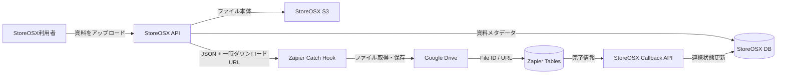

# StoreOSX Zapierファイル連携 運用設計

**作成者:** Manus AI
**作成日:** 2026-09-12

## 1. 結論

StoreOSXの資料アップロードを起点として、ファイル本体をStoreOSX標準クラウドストレージへ保存し、検索用メタデータをStoreOSXの資料DBへ記録します。その後、ZapierのCatch Hookへイベントを送り、Google Driveへのバックアップ保存とZapier Tablesへのファイル台帳記録を実行します。StoreOSX側の保存を先に確定するため、ZapierやGoogle Driveで障害が発生しても元ファイルと案件情報は失われません。

## 2. データフロー



## 3. 保存先と役割

| 保存先 | 保存内容 | 役割 |
|---|---|---|
| StoreOSX S3 | ファイル本体 | 正本。StoreOSXから常に閲覧できる保存先 |
| StoreOSX `documents` | 案件ID、ファイル名、カテゴリ、タグ、メモ、S3参照 | StoreOSX内の検索・案件紐付け用資料DB |
| StoreOSX `zapier_file_syncs` | 送信状態、試行回数、エラー、Drive URL、TablesレコードID | 外部連携の監査・再送管理 |
| Google Drive | Zapierが取得したファイルのバックアップ | 社外クラウドストレージ上の副本 |
| Zapier Tables | StoreOSX文書ID、案件・店舗情報、ファイル情報、Drive参照 | 簡易ファイル台帳 |

## 4. Zapierワークフロー

Zap名は **「StoreOSX ファイル保存・台帳登録」** です。トリガーにはWebhooks by ZapierのCatch Hookを使用します。Catch Hookは外部アプリからPOSTされたJSONを解析し、後続ステップで各項目を利用できます。[1]

| 順番 | Zapierアプリ／イベント | 主な設定 |
|---:|---|---|
| 1 | Webhooks by Zapier / Catch Hook | StoreOSXから受け取る固有URLをStoreOSXの「Zapier設定」へ登録 |
| 2 | Google Drive / Upload File | File=`source_file_url`、File Name=`file_stem`、File Extension=`file_extension`、保存フォルダ=`StoreOSX` |
| 3 | Zapier Tables / Create Record | Table ID=`01M2AS20424Z7E7P4GT4197QYC`。案件・ファイル・Drive情報を対応列へ登録 |
| 4 | Webhooks by Zapier / Custom Request | Method=`POST`。URL=`callback_url`へ完了状態、イベントID、Drive File ID、Drive URL、Tables Record IDをqueryで追加し、Basic Auth=`callback_basic_auth`を設定 |

コールバックは一時トークンをURLへ露出させないため、Basic Authのユーザー名を`sync`、パスワードを一時トークンとします。Zapierには両方を連結した`callback_basic_auth`が渡されます。queryは次の形式です。各値はZapierの動的データとして挿入し、URLエンコードします。

```text
?status=completed
&event_id={Triggerのevent_id}
&google_drive_file_id={Google DriveステップのFile ID}
&google_drive_url={Google Driveステップの代替リンク}
&zapier_table_record_id={Zapier TablesステップのRecord ID}
```

既存のJSON本文形式も後方互換として受理します。

## 5. Zapier Tables台帳

作成済みテーブルは **「StoreOSX ファイル台帳」** です。Table IDは `01M2AS20424Z7E7P4GT4197QYC` です。

| 列 | 入力元 |
|---|---|
| StoreOSX文書ID | `document_id` |
| 案件ID | `case_id` |
| 依頼番号 | `request_number` |
| 店舗名 | `store_name` |
| ファイル名 | `file_name` |
| MIMEタイプ | `mime_type` |
| ファイルサイズ | `file_size` |
| カテゴリ | `category` |
| タグ | `tags` |
| メモ | `memo` |
| StoreOSX URL | `storeosx_url` |
| Google Drive File ID | Google DriveステップのFile ID |
| Google Drive URL | Google Driveステップの代替リンク |
| 連携状態 | 固定値 `completed` |
| アップロード日時 | `uploaded_at` |

## 6. StoreOSXでの操作

管理者またはオーナーは「資料DB庫」の **Zapier設定** からCatch Hook URLを登録できます。通常利用者は従来どおり資料をアップロードするだけです。連携が成功した資料には「Drive保存済」、Zapier処理中は「Zapier処理中」、未設定または失敗時は「連携待ち」と表示されます。「連携待ち」の資料は再送ボタンから手動再送できます。

## 7. 障害時の動作

Zapierが未設定または一時的に失敗しても、StoreOSX S3と資料DBへの保存は完了します。Zapier送信は独立した状態として記録され、元の資料を再アップロードせずに再送できます。Zapierへ渡すのはファイル本体ではなく短時間有効な署名付きダウンロードURLです。Google Driveには`file_name`を拡張子なしの`file_stem`と`file_extension`に分けて渡し、Zapierが取得元URLの拡張子を二重付与しないようにします。Catch Hook URLは`https://hooks.zapier.com/hooks/catch/`配下だけを許可し、任意ホストへの送信を防ぎます。コールバック先はStoreOSXの固定公開URLを使用します。一時トークンはBasic Authで送り、URLやqueryへ含めません。再送のたびにイベントIDと一時トークンを更新し、DBにはトークンのSHA-256ハッシュだけを保存します。古いZap実行から届いた応答はイベント不一致として拒否します。

## 8. 検証項目

| 確認項目 | 合格条件 |
|---|---|
| StoreOSX保存 | アップロード後に資料DB庫からファイルを開ける |
| Zapier受信 | ZapierのTrigger Testに`document_id`と`source_file_url`が表示される |
| Google Drive | 指定フォルダに同じファイル名で保存される |
| Zapier Tables | 15列の台帳レコードが1件追加される |
| コールバック | StoreOSX表示が「Drive保存済」に更新される |
| 再送 | Zapier停止後の失敗データを再送して正常完了できる |

## 9. 稼働情報

| 項目 | 現在値 |
|---|---|
| Zap ID | `379890976` |
| Zapバージョン | `v1` |
| 公開状態 | 公開済み・稼働中 |
| Google Drive接続 | `k.miyoshi0422@gmail.com` |
| Google Drive保存フォルダ | `StoreOSX`（Folder ID: `1rXINhx3atczbHbKB4Weg_qNTZIaWyT06`） |
| Zapier Tables | `StoreOSX ファイル台帳`（Table ID: `01M2AS20424Z7E7P4GT4197QYC`） |
| StoreOSX設定 | 本番環境の「資料DB庫」からCatch Hook URL登録済み |
| 公開日 | 2026-09-12 |

## References

[1]: https://help.zapier.com/hc/en-us/articles/8496288690317-Trigger-Zap-workflows-from-webhooks "Trigger Zap workflows from webhooks"
